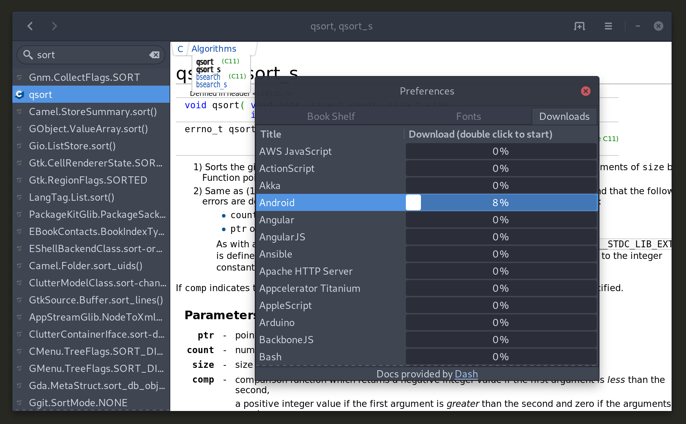

# ZevDocs

ZevDocs is a fork of [Devhelp](https://wiki.gnome.org/Apps/Devhelp) with support for [zealcore](https://github.com/jkozera/zealcore/), which allows it to download more types of API documentation, in addition to GNOME documentation.

